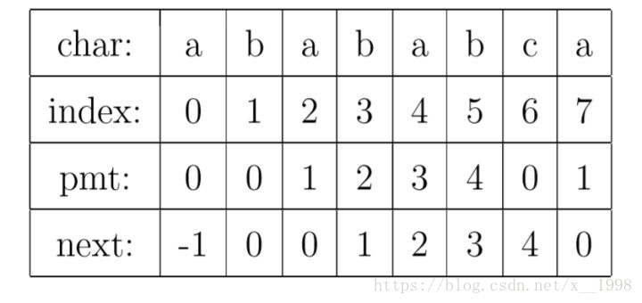

**题目描述**

Given a string **s**, you are allowed to convert it to a palindrome by adding characters in front of it. Find and return the shortest palindrome you can find by performing this transformation.

**Example 1:**

```
Input: "aacecaaa"
Output: "aaacecaaa"
```

**Example 2:**

```
Input: "abcd"
Output: "dcbabcd"
```

<!--more-->

给定一个字符串，我们需要在字符串的开头添加若干字符串，使新的字符串成为回文的字符串。比如“abcd”变成“dcbabcd”；“aacecaaa”变成“aaacecaaa”

如果一个字符串A可以表示为BS，其中B和S非空，那么B就是A的在该字符串中的前缀，S为字符串的后缀。这一题的核心就是去求该字符串回文前缀有多长，比如“aacecaaa”的回文前缀最长为“aacecaa”，我们就只需要再补一个“a”，与最后一个字符“a”对应就可以了。

如果对长度为n的字符串从第0个位置到第n/2个位置分别判断是否为回文字符串，那么其时间复杂度是n^2。

但是这里我们会使用KMP算法中的next数组。next数组存储了每一个索引之前的子字符串的前缀与后缀相同的最大值。

对于字符串abababca来说，当index = 5时，其之前的字符串为"ababa"，"ababa"的前缀为["a", "ab", "aba", "abab"]，后缀是["a", "ba", "aba", "baba"]，前缀和后缀中最长的相同字符串为"aba"，因此这里的next[5]就是3。




对于本题，我们的方法是将原字符串的逆序添加到原字符串的后面，因为我们要找的是字符串的前序回文字符串的最大值，那么这个回文字符串的逆序会在新生成的字符串的最后，并且与开头的这个回文字符串相同，因此本题就转化成了求解这个新生成的字符串的next。

举个例子，对于"aacecaaa"来说，我们会在它之后加一个特殊字符作为切分，然后添加它的逆字符串，生成"aacecaaa#aaacecaa"，并且在最后再加上一位，让next[-1]能表示新增一位的前面的所有字符。最终生成的字符串为"aacecaaa#aaacecaa*"。对于next[-1]来说，其对应的子字符串为"aacecaaa#aaacecaa"的前缀和后缀相同的字符串的长度，也就是“aacecaa”，长度为7，这样就找到了原字符串的最长回文前缀了。

KMP算法的next数组可以帮助我们很快找到字符串的前缀和后缀的相同字符串。next的求法如下所示：

```python
    def getNext(self, p):
        next = [0] * len(p)
        next[0] = -1
        i = 0
        j = next[0]

        while i < len(p)-1:
            if j == -1 or p[i] == p[j]:
                i += 1
                j += 1
                next[i] = j
            else:
                j = next[j]

        return next
```

其核心思想就是维护两个索引，其中i为next的下一个需要求的索引，j为最长的回文前缀的索引。由于next保存了i之前的前缀和后缀的最大相同值，因此让j=next[i]，可以保证其i+1的最长相同值不大于j。

**代码实现**

```python
class Solution:
    def shortestPalindrome(self, s: str) -> str:
        newS = s + '#'
        for i in range(len(s)-1, -1, -1):
            newS += s[i]

        newS += "*"

        next = self.getNext(newS)
        index = next[-1]
        result = ""

        for i in range(len(s)-1, index-1, -1):
            result += s[i]

        result += s
        return result

    def getNext(self, p):
        next = [0] * len(p)
        next[0] = -1
        i = 0
        j = next[0]

        while i < len(p)-1:
            if j == -1 or p[i] == p[j]:
                i += 1
                j += 1
                next[i] = j
            else:
                j = next[j]

        return next
```

