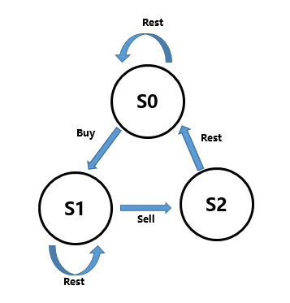

**题目描述**

Say you have an array for which the *i*th element is the price of a given stock on day *i*.

Design an algorithm to find the maximum profit. You may complete as many transactions as you like (ie, buy one and sell one share of the stock multiple times) with the following restrictions:

- You may not engage in multiple transactions at the same time (ie, you must sell the stock before you buy again).
- After you sell your stock, you cannot buy stock on next day. (ie, cooldown 1 day)

**Example:**

```
Input: [1,2,3,0,2]
Output: 3 
Explanation: transactions = [buy, sell, cooldown, buy, sell]
```

<!--more-->


我好菜啊，dp自己怎么都想不出...

这题可以用一种状态机的思路来做，具体思路如下：



其中$S_{0}$表示没有买入的时候的状态，$S_{1}$表示买入后持有的状态，$S_{2}$表示刚刚卖出的时候的cool down。状态及可以表示出三个状态的表示过程，通过状态机，我们可以写出三个状态的转移方程：

$$S_{0}[i]=\max(S_{0}[i-1], S_{2}[i-1]) \\ S_{1}[i]=\max(S_{1}[i-1], S_{0}[i-1]-price[i])\\S_{2}[i]=price[i]+S_{1}[i-1]​$$

在最后，$\max(S_{0}[-1], S_{1}[-1], S_{2}[-1])$就是该方案的最大收益。

**代码实现**

```python
class Solution:
    def maxProfit(self, prices: 'list[int]') -> 'int':
        if len(prices) == 0:
            return 0

        dp = [[0] * len(prices) for _ in range(3)]
        dp[1][0] = -prices[0]

        for i in range(1, len(prices)):
            dp[0][i] = max(dp[0][i - 1], dp[2][i - 1])
            dp[1][i] = max(dp[1][i - 1], dp[0][i - 1] - prices[i])
            dp[2][i] = prices[i] + dp[1][i - 1]

        return max(dp[0][-1], dp[1][-1], dp[2][-1])
```


