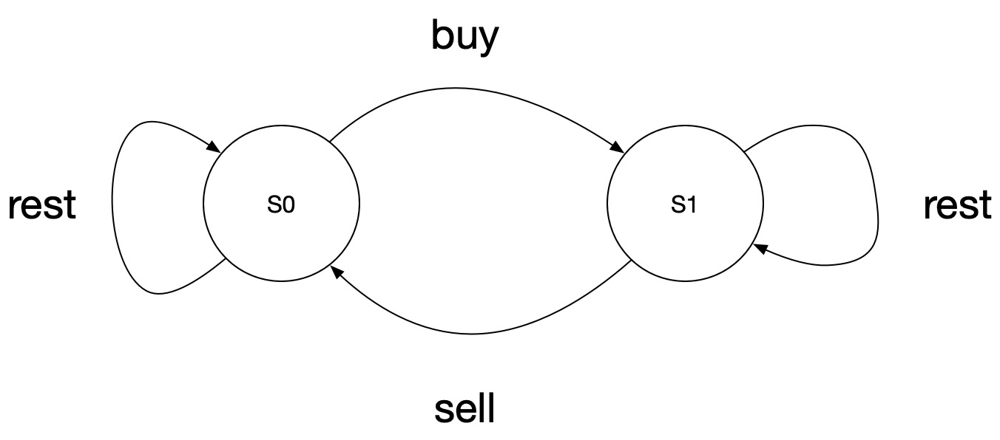

**题目描述**

Your are given an array of integers `prices`, for which the `i`-th element is the price of a given stock on day `i`; and a non-negative integer `fee` representing a transaction fee.

You may complete as many transactions as you like, but you need to pay the transaction fee for each transaction. You may not buy more than 1 share of a stock at a time (ie. you must sell the stock share before you buy again.)

Return the maximum profit you can make.

**Example 1:**

```
Input: prices = [1, 3, 2, 8, 4, 9], fee = 2
Output: 8
Explanation: The maximum profit can be achieved by:
Buying at prices[0] = 1Selling at prices[3] = 8Buying at prices[4] = 4Selling at prices[5] = 9The total profit is ((8 - 1) - 2) + ((9 - 4) - 2) = 8.
```

<!--more-->


这题有了309铺路之后就显得很好做，也是使用状态机来表示，无非这里只有两个状态（没有了$S_{2}$）




$S_{0}$是未买入时的状态，$S_{1}$为买入后的状态，状态转移方程为：

$$S_{0}[i]=\max(S_{0}[i-1], S_{1}[i-1]+price[i]-fee) \\ S_{1}[i]=\max(S_{1}[i-1], S_{0}[i-1]-price[i])$$

**代码实现**

```python
class Solution:
    def maxProfit(self, prices: 'list[int]', fee: 'int') -> 'int':
        if len(prices) == 0:
            return 0

        dp = [[0] * len(prices) for _ in range(2)]
        dp[1][0] = -prices[0]

        for i in range(1, len(prices)):
            dp[0][i] = max(dp[0][i - 1], dp[1][i - 1] + prices[i] - fee)
            dp[1][i] = max(dp[1][i - 1], dp[0][i - 1] - prices[i])

        return dp[0][-1]
```

